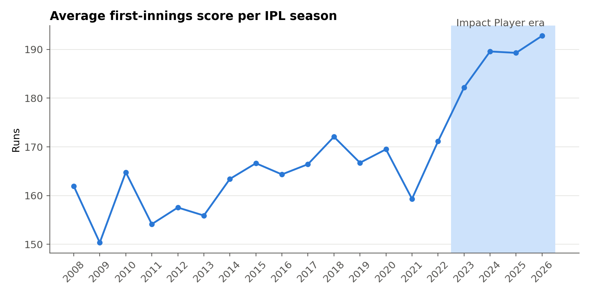
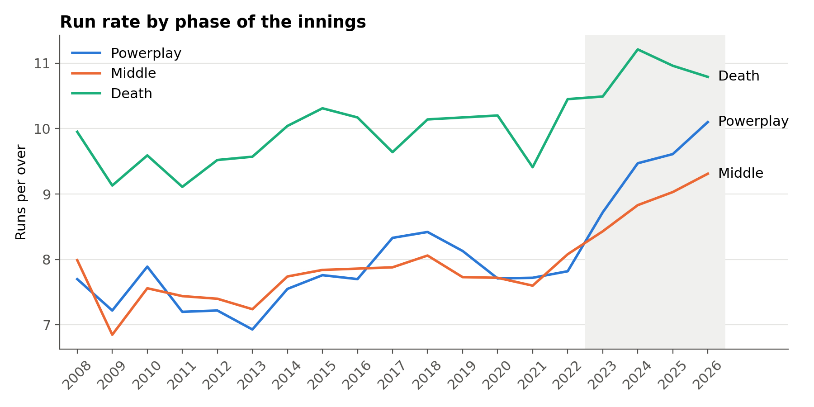
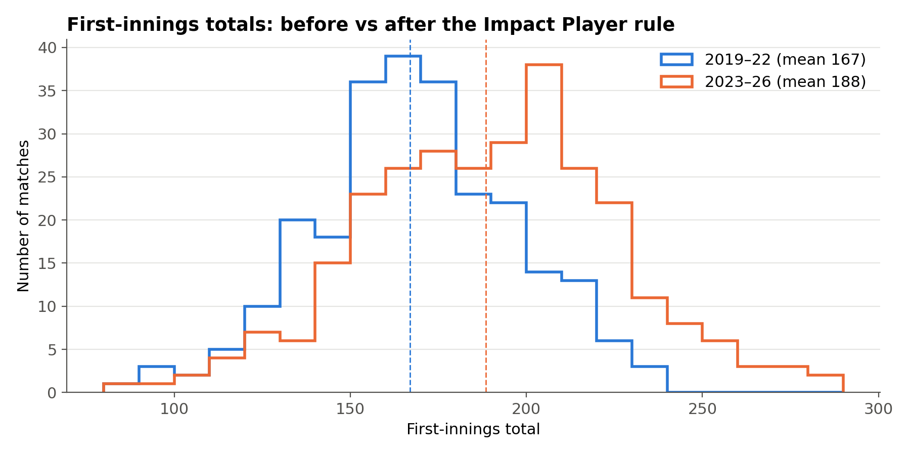

# Did the Impact Player rule change the IPL? A data analysis (2008–2026)

Analysis of every IPL match from 2008 to 2026 (1,243 matches, 295,732 deliveries) using **SQL and Python**, to test whether the Impact Player rule introduced in 2023 changed scoring, and what that means for viewer engagement.

Author: Souvik Mondal

## Key findings

| Question | Result | Statistically significant? |
|---|---|---|
| Did first-innings scores rise after 2023? | **+21.6 runs** (166.9 → 188.5) | Yes, Welch's t-test, p ≈ 6 × 10⁻¹³ |
| Was there a similar jump before the rule? (placebo) | No change (167.4 → 166.9) | No, p = 0.87 |
| Which phase changed most? | Powerplay: 7.8 → 10.1 runs per over (2022 → 2026) | — |
| More highlight moments? | Sixes per match **+37%**, boundaries **+21%** | — |
| More close finishes? | Fell from 35% to 29% | No, p = 0.18 (chi-square) |

## What this means for a streaming platform

- **More shareable moments:** about 37% more sixes per match means more highlight clips and short-form content.
- **A possible engagement risk:** close finishes are trending down. If chases become one-sided, viewers may leave before the end, which hurts late-match watch time and ad inventory.
- **Recommendation:** watch the close-finish rate as more seasons come in, and when a match turns one-sided, offer personalised highlights or other live matches to keep viewers on the platform.

## Method

1. **Data:** ball-by-ball match files from [Cricsheet](https://cricsheet.org), combined with pandas and loaded into a SQLite database.
2. **Cleaning:**
   - Removed a combined `all_matches.csv` file that double-counted every ball. I caught this by checking balls per match (476 instead of about 240).
   - Standardised season labels (for example `2007/08` → 2008) using the match date.
   - Merged renamed franchises (for example Delhi Daredevils → Delhi Capitals).
   - Excluded rain-affected (DLS) matches from score comparisons.
3. **Analysis in SQL:** win rates, run rates by phase (powerplay overs 1–6, middle 7–15, death 16–20), boundary and six counts, and close-finish rates, using CTEs, CASE WHEN and window functions.
4. **Statistical tests:** Welch's t-test for the score change, a placebo test on earlier seasons, and a chi-square test for close finishes.

## Limitations

- This shows that scores rose **when** the rule arrived. It does not prove the rule **caused** it. Bats, pitches and batting strategy also changed. The flat placebo period makes the rule the most likely explanation, but not the only one.
- "Close finish" is my own definition: won by 10 runs or fewer, or a chase completed in the final over.
- Four seasons after the rule is not enough data to detect a small change in close finishes.

## How to run

1. Download the IPL CSV files from cricsheet.org/downloads into `data/ipl_csv2/`.
2. `pip install pandas scipy matplotlib jupyter`
3. Open `analysis.ipynb` and run all cells.